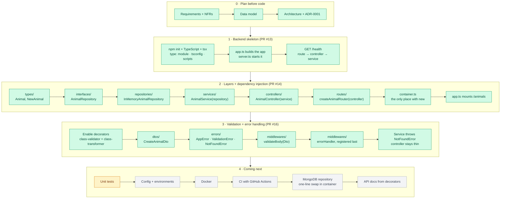

# Backend setup — how it was built

Green = done · Yellow = next · Grey = later

```mermaid
flowchart TD
  subgraph P0["0 · Plan before code"]
    R["Requirements + NFRs"] --> DM["Data model"] --> AR["Architecture + ADR-0001"]
  end

  subgraph S1["1 · Backend skeleton (PR #13)"]
    K1["npm init + TypeScript + tsx<br/>type: module · tsconfig · scripts"] --> K2["app.ts builds the app<br/>server.ts starts it"] --> K3["GET /health<br/>route → controller → service"]
  end

  subgraph S2["2 · Layers + dependency injection (PR #14)"]
    D1["types/<br/>Animal, NewAnimal"] --> D2["interfaces/<br/>AnimalRepository"] --> D3["repositories/<br/>InMemoryAnimalRepository"] --> D4["services/<br/>AnimalService(repository)"] --> D5["controllers/<br/>AnimalController(service)"] --> D6["routes/<br/>createAnimalRouter(controller)"] --> D7["container.ts<br/>the only place with new"] --> D8["app.ts mounts /animals"]
  end

  subgraph S3["3 · Validation + error handling (PR #16)"]
    V1["Enable decorators<br/>class-validator + class-transformer"] --> V2["dtos/<br/>CreateAnimalDto"] --> V3["errors/<br/>AppError · ValidationError · NotFoundError"] --> V4["middlewares/<br/>validateBody(Dto)"] --> V5["middlewares/<br/>errorHandler, registered last"] --> V6["Service throws NotFoundError<br/>controller stays thin"]
  end

  subgraph NX["4 · Coming next"]
    N1["Unit tests"] --> N2["Config + environments"] --> N3["Docker"] --> N4["CI with GitHub Actions"] --> N5["MongoDB repository<br/>one-line swap in container"] --> N6["API docs from decorators"]
  end

  P0 --> S1 --> S2 --> S3 --> NX

  classDef done fill:#d1fae5,stroke:#059669,color:#064e3b
  classDef next fill:#fef3c7,stroke:#d97706,color:#78350f
  classDef todo fill:#f3f4f6,stroke:#9ca3af,color:#374151
  class R,DM,AR,K1,K2,K3,D1,D2,D3,D4,D5,D6,D7,D8,V1,V2,V3,V4,V5,V6 done
  class N1 next
  class N2,N3,N4,N5,N6 todo
```
